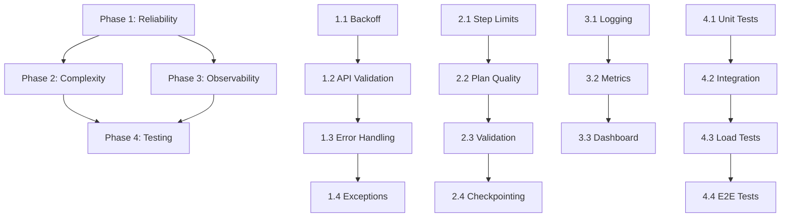

# PhoenixWright Robustness Implementation Plan

## Executive Summary

Transform PhoenixWright from a PoC (40-60% success on medium complexity) to a production-ready system (85%+ success on complex multi-step queries). 

**Target State**: 
- Handle 6-10 dependent operations reliably
- Graceful error recovery with exponential backoff
- Full observability & user feedback
- Support concurrent requests (within API limits)

---

## Phase 1: Reliability Foundation
**Goal**: Stop cascade failures, add graceful error handling

### 1.1 Add Exponential Backoff & Rate Limiting
**Files**: `agent/config.py`, `agent/services/browser_agent.py`, `agent/orchestrator/chat_orchestrator.py`

**Changes**:
- Add retry configuration to `config.py`
- Implement `RetryStrategy` class with exponential backoff
- Detect transient (429, timeout) vs permanent (401, 403) errors
- Circuit breaker for API quota exhaustion

**Pseudo-code**:
```python
class RetryStrategy:
    def __init__(self, max_retries=5, base_delay=1, max_delay=60):
        self.max_retries = max_retries
        self.base_delay = base_delay
        self.max_delay = max_delay
    
    def is_transient_error(self, error_code: int) -> bool:
        # 429: quota, 503/504: service unavailable, timeouts
        return error_code in {429, 503, 504, 408}
    
    async def execute_with_retry(self, fn, *args):
        for attempt in range(self.max_retries):
            try:
                return await fn(*args)
            except APIError as e:
                if not self.is_transient_error(e.code):
                    raise  # permanent error, don't retry
                
                delay = min(self.base_delay * (2 ** attempt), self.max_delay)
                await asyncio.sleep(delay)
        raise RetryExhausted()
```

**Tests**:
- Mock quota error (429) → verify backoff delay increases
- Mock permanent error (401) → verify immediate raise
- Verify circuit breaker trips after 3 quota hits


---

### 1.2 API Key Validation on Startup
**Files**: `agent/config.py`, `agent/services/browser_agent.py`, `agent/runner.py`

**Changes**:
- Add `validate_api_key()` function
- Test LLM connectivity before running agent
- Report clear errors if credentials missing/invalid
- Add validation to chat/query entry points

**Pseudo-code**:
```python
async def validate_api_key(api_key: str, model: str) -> bool:
    """Quick test call to verify API key + model compatibility."""
    try:
        llm = ChatGoogle(model=model, api_key=api_key)
        # Send minimal inference request
        result = await llm.apredict("test")
        return True
    except AuthenticationError:
        raise ConfigError("Invalid GEMINI_API_KEY")
    except QuotaError:
        raise ConfigError("API quota exhausted. Wait 15-20s or upgrade plan")
    except Exception as e:
        raise ConfigError(f"LLM connectivity error: {e}")
```

**Tests**:
- Valid key → pass validation
- Missing key → ConfigError
- Expired key → AuthenticationError → clear message
- Quota exceeded → QuotaError → suggest upgrade

---

### 1.3 Structured Error Handling in Chat Loop
**Files**: `agent/runner.py` (lines 245-260)

**Changes**:
- Replace silent exception catch with structured error reporting
- Distinguish user-actionable errors from system errors
- Add error retry prompts ("Retry? [y/n]")

**Current code** (WEAK):
```python
try:
    result = await _run_prompt(task_prompt)
    assistant_text = _stringify_agent_result(result)
    print(f"agent> {assistant_text}")
except Exception:
    import traceback
    traceback.print_exc()  # ← Only prints traceback, no user message
```

**New code**:
```python
try:
    result = await _run_prompt(task_prompt)
    assistant_text = _stringify_agent_result(result)
    if not assistant_text:
        print("agent> Completed with no textual output.")
    else:
        print(f"agent> {assistant_text}")
except QuotaExhaustedError as e:
    print(f"\n❌ API quota exceeded: {e.retry_after}s cooldown needed")
    print("   Options: /wait, /retry, or try again in 20s\n")
except TimeoutError as e:
    print(f"\n⏱️  Browser timeout after {e.seconds}s")
    print("   Options: /retry (restart agent), /clear (reset history)\n")
except ValidationError as e:
    print(f"\n🚨 Plan validation failed: {e.message}")
    print("   The query may be too complex. Try /clear and /retry\n")
except Exception as e:
    logger.error(f"Unexpected error: {e}", exc_info=True)
    print(f"\n⚠️  Unexpected error: {type(e).__name__}")
    print(f"   Details: {str(e)[:100]}")
    print("   Try: /retry, /clear, or restart agent\n")
```

**Tests**:
- Verify correct error message for each error type
- Verify suggestions are actionable

---

### 1.4 Create Custom Exception Hierarchy
**Files**: `agent/exceptions.py` (NEW)

**Content**:
```python
class PhoenixWrightError(Exception):
    """Base exception for all agent errors."""
    pass

class ConfigError(PhoenixWrightError):
    """Configuration/environment issue (no API key, invalid model)."""
    pass

class APIError(PhoenixWrightError):
    """LLM API error (quota, auth, service unavail)."""
    def __init__(self, code: int, message: str, retry_after: int = None):
        self.code = code
        self.retry_after = retry_after
        super().__init__(message)

class PlanValidationError(PhoenixWrightError):
    """Plan doesn't pass safety checks."""
    pass

class BrowserTimeoutError(PhoenixWrightError):
    """Browser action timeout."""
    def __init__(self, action: str, seconds: int):
        self.action = action
        self.seconds = seconds
        super().__init__(f"{action} timed out after {seconds}s")

class StagnationError(PhoenixWrightError):
    """Agent stuck (5+ consecutive failures)."""
    pass

class RetryExhaustedError(PhoenixWrightError):
    """Retry limit exceeded."""
    pass
```

---

## Phase 2: Complexity Handling
**Goal**: Enable 6-10 step workflows, improve plan quality

### 2.1 Increase Step Limits & Add Per-Action Timeouts
**Files**: `agent/config.py`, `agent/services/browser_agent.py`

**Changes**:
- MAX_STEPS: 20 → 50 (supports more complex workflows)
- Add per-action timeout config (currently none)
- Timeout staggering: navigate=15s, fill=8s, verify=20s
- Add action timing telemetry

**New config**:
```python
# agent/config.py
MAX_STEPS = 50  # was 20

# Action-specific timeouts (seconds)
ACTION_TIMEOUTS = {
    "navigate": 15,
    "search_user": 10,
    "fill_create_user_form": 8,
    "submit_create_form": 10,
    "set_license": 8,
    "set_password": 8,
    "submit_user_update": 10,
    "verify_outcome": 20,  # longest, allows for result parsing
}

# Retry strategy
RETRY_CONFIG = {
    "max_retries": 5,
    "base_delay_seconds": 1,
    "max_delay_seconds": 60,
}

# Plan generation
PLAN_MAX_NODES = 20  # was 15 (more room for complex workflows)
PLAN_MAX_ATTEMPTS = 3  # was 2 (retry harder on plan generation)
```

**Tests**:
- Navigate action gets 15s timeout
- Verify outcome gets 20s timeout
- Timeout triggers RetryableError (not permanent failure)
- Timing metrics logged

---

### 2.2 Improve Task Decomposition (Dynamic Planner)
**Files**: `agent/planner/decomposer.py`, `agent/planner/plan_prompt.py`

**Changes**:
- Add context from previous failures into plan regeneration
- Include schema examples for multi-step patterns
- Add "estimated_complexity" scoring to plan
- Better handling of dependent operations

**Enhanced plan_prompt**:
```python
def build_planner_prompt(request, history, policy, prior_error=""):
    actions = ", ".join(action.value for action in NodeAction)
    
    # Add examples for common patterns
    examples = {
        "multi_create": "Create 3 users with different licenses → [navigate, create_user_1, create_user_2, create_user_3, verify]",
        "conditional": "Find user, then update if exists → [navigate, search, verify_found, update_if_found, verify_outcome]",
        "batch_update": "Reset 5 passwords → [navigate, get_user_1, reset_1, get_user_2, reset_2, ..., verify]",
    }
    
    # Complexity guidance
    complexity_guidance = """
    - Simple (1-2 steps): navigate → single action → verify
    - Medium (3-5 steps): navigate → search → multi-step transaction → verify
    - Complex (6-10 steps): multi-object operations OR conditional flows
    
    For complex plans:
    - Group related operations
    - Order dependencies correctly (navigate first, verify last)
    - Use depends_on to clarify sequencing
    """
    
    sections = [
        "You generate micro-step execution plans for admin dashboard automation.",
        f"Hard boundary: {policy.allowed_origin}",
        policy.allowed_paths_description(),
        "Return valid JSON only.",
        f"Allowed actions: {actions}",
        f"Max nodes: {PLAN_MAX_NODES}",
        "",
        complexity_guidance,
        "",
        "Common patterns:",
        *[f"- {k}: {v}" for k, v in examples.items()],
        "",
        f"User request: {request}",
    ]
    
    if prior_error:
        sections.extend([
            "",
            "Previous plan failed. Issues to fix:",
            f"- {prior_error}",
            "Regenerate with corrections.",
        ])
    
    return "\n".join(sections)
```

**Tests**:
- Multi-create request → generates proper 5-node plan
- Conditional request → generates search+branch logic
- Prior error context → plan differs from first attempt


---

### 2.3 Enhanced Plan Validation & Complexity Scoring
**Files**: `agent/planner/validator.py`, `agent/planner/schemas.py`

**Changes**:
- Add complexity scoring (simple/medium/complex)
- Validate dependency graphs (no cycles, proper ordering)
- Check for unreachable nodes
- Warn on fragile patterns (long chains, many dependencies)

**New code** (in `schemas.py`):
```python
@dataclass
class TaskGraph:
    intent: str
    user_request: str
    nodes: List[TaskNode]
    notes: List[str] = field(default_factory=list)
    
    @property
    def complexity_score(self) -> str:
        """Estimate plan complexity: simple/medium/complex."""
        if len(self.nodes) <= 2:
            return "simple"
        elif len(self.nodes) <= 5:
            return "medium"
        else:
            return "complex"
    
    def has_cycles(self) -> bool:
        """Check for circular dependencies."""
        visited = set()
        rec_stack = set()
        
        def dfs(node_id):
            visited.add(node_id)
            rec_stack.add(node_id)
            
            for node in self.nodes:
                if node.id == node_id:
                    for dep in node.depends_on:
                        if dep not in visited:
                            if dfs(dep):
                                return True
                        elif dep in rec_stack:
                            return True
            
            rec_stack.remove(node_id)
            return False
        
        for node in self.nodes:
            if node.id not in visited:
                if dfs(node.id):
                    return True
        return False
    
    def get_critical_path(self) -> List[str]:
        """Return longest dependency chain (critical path)."""
        # Uses topological sort + longest path algorithm
        pass
```

**New validation** (in `validator.py`):
```python
def validate(self, graph: TaskGraph) -> None:
    if not graph.nodes:
        raise TaskGraphValidationError("Plan graph is empty")
    
    # Existing checks...
    
    # NEW: Cycle detection
    if graph.has_cycles():
        raise TaskGraphValidationError("Plan has circular dependencies")
    
    # NEW: Complexity warning
    if graph.complexity_score == "complex" and len(graph.nodes) > 10:
        logger.warning(f"High complexity plan: {len(graph.nodes)} nodes. May exceed timeout.")
    
    # NEW: Reachability check
    reachable = self._compute_reachable_nodes(graph)
    for node in graph.nodes:
        if node.id not in reachable and node.action != NodeAction.NAVIGATE:
            raise TaskGraphValidationError(f"Node {node.id} is unreachable (orphaned)")
```

**Tests**:
- Plan with cycles → validation error
- Plan with orphaned nodes → validation error
- 6-node plan → "complex" scoring
- 3-node plan → "medium" scoring

---

### 2.4 State Checkpointing for Long-Running Tasks
**Files**: `agent/services/browser_agent.py`, `agent/orchestrator/chat_orchestrator.py` (NEW: `agent/state_manager.py`)

**Changes**:
- Save plan state after each step
- Enable resume-on-failure
- Track which operations completed
- Support skip/retry individual steps

**New file** (`agent/state_manager.py`):
```python
import json
from dataclasses import asdict
from pathlib import Path
from typing import Dict, Optional
from agent.planner.schemas import TaskGraph, TaskNode

class ExecutionState:
    """Checkpoint for long-running task execution."""
    
    def __init__(self, plan_id: str, graph: TaskGraph):
        self.plan_id = plan_id
        self.graph = graph
        self.completed_steps: Dict[str, bool] = {n.id: False for n in graph.nodes}
        self.step_results: Dict[str, str] = {}
        self.errors: Dict[str, str] = {}
    
    def save(self, path: Path = None):
        """Persist to disk."""
        path = path or Path.home() / ".phoenix_wright" / f"{self.plan_id}.json"
        path.parent.mkdir(exist_ok=True)
        
        with open(path, "w") as f:
            json.dump({
                "plan_id": self.plan_id,
                "completed_steps": self.completed_steps,
                "step_results": self.step_results,
                "errors": self.errors,
            }, f, indent=2)
    
    @staticmethod
    def load(plan_id: str, path: Path = None) -> Optional["ExecutionState"]:
        """Load from disk."""
        path = path or Path.home() / ".phoenix_wright" / f"{plan_id}.json"
        if not path.exists():
            return None
        
        with open(path) as f:
            data = json.load(f)
            state = ExecutionState(data["plan_id"], None)  # Graph loaded separately
            state.completed_steps = data["completed_steps"]
            state.step_results = data["step_results"]
            state.errors = data["errors"]
            return state
    
    def mark_complete(self, step_id: str, result: str):
        self.completed_steps[step_id] = True
        self.step_results[step_id] = result
        if step_id in self.errors:
            del self.errors[step_id]
    
    def mark_error(self, step_id: str, error: str):
        self.errors[step_id] = error
    
    @property
    def next_incomplete_step(self) -> Optional[str]:
        """Return first uncompleted step ID."""
        for node_id in self.completed_steps:
            if not self.completed_steps[node_id]:
                return node_id
        return None
```

**Integration**:
```python
async def run_task_with_checkpoints(task_prompt: str, allow_resume: bool = True):
    """Execute with state checkpointing."""
    plan_id = hashlib.md5(task_prompt.encode()).hexdigest()
    
    # Try load existing state (for resume)
    state = ExecutionState.load(plan_id) if allow_resume else None
    
    agent = BrowserAgentService.get_agent(task_prompt)
    result = await agent.run()
    
    # Save state after each completion
    state.mark_complete(current_step_id, result)
    state.save()
    
    return result
```

**Tests**:
- Execute 3-step plan → checkpoint after step 1 → simulate crash → resume → complete remaining steps
- Verify step 1 not re-executed
- Verify final result correct


---

---

---

## Phase 3: Observability & Monitoring
**Goal**: Full instrumentation for debugging + user feedback

### 3.1 Structured Logging Framework
**Files**: `agent/logging_config.py` (NEW), `agent/runner.py`

**Changes**:
- Replace `print()` statements with structured logging
- Log all LLM calls (prompt, response, latency)
- Log browser actions (timing, success/failure)
- Export to JSON for analysis

**New file** (`agent/logging_config.py`):
```python
import logging
import json
from datetime import datetime
from pythonjsonlogger import jsonlogger

class StructuredLogger:
    def __init__(self, name: str, log_file: str = None):
        self.logger = logging.getLogger(name)
        self.logger.setLevel(logging.DEBUG)
        
        # Console handler (INFO level)
        console = logging.StreamHandler()
        console.setLevel(logging.INFO)
        console.setFormatter(logging.Formatter(
            '%(levelname)-8s [%(name)s] %(message)s'
        ))
        self.logger.addHandler(console)
        
        # File handler (DEBUG level, JSON format)
        if log_file:
            file_handler = logging.FileHandler(log_file)
            file_handler.setLevel(logging.DEBUG)
            file_handler.setFormatter(jsonlogger.JsonFormatter())
            self.logger.addHandler(file_handler)
    
    def log_llm_call(self, model: str, prompt: str, response: str, latency_ms: int):
        self.logger.info("llm_call", extra={
            "model": model,
            "prompt_chars": len(prompt),
            "response_chars": len(response),
            "latency_ms": latency_ms,
            "timestamp": datetime.now().isoformat(),
        })
    
    def log_browser_action(self, action: str, step_id: str, success: bool, latency_ms: int, error: str = None):
        self.logger.info("browser_action", extra={
            "action": action,
            "step_id": step_id,
            "success": success,
            "latency_ms": latency_ms,
            "error": error,
            "timestamp": datetime.now().isoformat(),
        })
    
    def log_plan_generated(self, intent: str, num_steps: int, complexity: str):
        self.logger.info("plan_generated", extra={
            "intent": intent,
            "num_steps": num_steps,
            "complexity": complexity,
        })
```

**Integration**:
```python
# In decomposer.py
logger = StructuredLogger(__name__, "logs/agent.jsonl")
graph = self._build_plan_with_langgraph(request, history)
logger.log_plan_generated(graph.intent, len(graph.nodes), graph.complexity_score)
```

**Tests**:
- Verify JSON log entries have all fields
- Parse JSON logs → extract timing metrics

---

### 3.2 Metrics & Telemetry Collection
**Files**: `agent/metrics.py` (NEW)

**Changes**:
- Track success rates by task type
- Record latency distributions
- Monitor API quota usage
- Built-in report generation

**New file** (`agent/metrics.py`):
```python
from dataclasses import dataclass, field
from collections import defaultdict
import statistics

@dataclass
class TaskMetrics:
    task_type: str
    total_attempts: int = 0
    successful_attempts: int = 0
    failed_attempts: int = 0
    latencies_ms: list = field(default_factory=list)
    errors: dict = field(default_factory=lambda: defaultdict(int))  # error_type → count
    
    @property
    def success_rate(self) -> float:
        if self.total_attempts == 0:
            return 0.0
        return self.successful_attempts / self.total_attempts
    
    @property
    def avg_latency_ms(self) -> float:
        if not self.latencies_ms:
            return 0.0
        return statistics.mean(self.latencies_ms)
    
    @property
    def p95_latency_ms(self) -> float:
        if len(self.latencies_ms) < 2:
            return 0.0
        return statistics.quantiles(self.latencies_ms, n=20)[18]  # 95th percentile

class MetricsCollector:
    def __init__(self):
        self.task_metrics = defaultdict(lambda: TaskMetrics())
        self.total_api_calls = 0
        self.total_api_quota_hits = 0
    
    def record_task_attempt(self, task_type: str, success: bool, latency_ms: int, error: str = None):
        metrics = self.task_metrics[task_type]
        metrics.total_attempts += 1
        if success:
            metrics.successful_attempts += 1
        else:
            metrics.failed_attempts += 1
            if error:
                metrics.errors[error] += 1
        metrics.latencies_ms.append(latency_ms)
    
    def generate_report(self) -> str:
        lines = ["=== PhoenixWright Metrics Report ===\n"]
        
        for task_type, metrics in sorted(self.task_metrics.items()):
            lines.append(f"Task: {task_type}")
            lines.append(f"  Success Rate: {metrics.success_rate:.1%}")
            lines.append(f"  Attempts: {metrics.total_attempts}")
            lines.append(f"  Avg Latency: {metrics.avg_latency_ms:.0f}ms")
            lines.append(f"  P95 Latency: {metrics.p95_latency_ms:.0f}ms")
            if metrics.errors:
                lines.append(f"  Top Errors: {dict(metrics.errors)}")
            lines.append("")
        
        return "\n".join(lines)
```

**Tests**:
- Record 10 attempts (7 success, 3 failure) → verify 70% success rate
- Verify latency percentiles calculated correctly

---

### 3.3 User Feedback Dashboard (CLI REPL enhancement)
**Files**: `agent/runner.py`

**Changes**:
- Add `/stats` command showing current session metrics
- Add `/performance` command with latency breakdown
- Add `/quota-status` showing estimated API quota remaining
- Add `/explain-error` showing why last task failed

**New commands**:
```python
if lower == "/stats":
    print(metrics_collector.generate_report())
    continue

if lower == "/performance":
    print("Last 5 actions timing:")
    for action, latency in recent_actions[-5:]:
        print(f"  {action}: {latency}ms")
    continue

if lower == "/quota-status":
    remaining = estimate_api_quota_remaining()
    print(f"Approx quota remaining: {remaining} requests")
    if remaining < 10:
        print("⚠️  Low quota, consider waiting before next request")
    continue

if lower == "/explain-error":
    if not last_error:
        print("No error from previous run")
    else:
        print(f"Error: {last_error}")
        print("\nLikely causes:")
        for cause in get_error_suggestions(last_error):
            print(f"  • {cause}")
    continue
```

---

## Phase 4: Testing & Validation
**Goal**: Comprehensive test coverage, integration tests for complex workflows

### 4.1 Unit Tests for Error Handling
**Files**: `tests/test_error_handling.py` (NEW)

**Coverage**:
- Retry strategy with backoff
- Transient vs permanent error detection
- API key validation
- Custom exception hierarchy

**Example tests**:
```python
@pytest.mark.asyncio
async def test_exponential_backoff_increases_delay():
    strategy = RetryStrategy(max_retries=3, base_delay=1)
    delays = []
    
    mock_fn = AsyncMock(side_effect=[
        APIError(429, "Quota exceeded"),
        APIError(429, "Quota exceeded"),
        "success"
    ])
    
    with patch('asyncio.sleep', side_effect=lambda x: delays.append(x)):
        result = await strategy.execute_with_retry(mock_fn)
    
    assert result == "success"
    assert delays == [1, 2]  # 2^0=1, 2^1=2

@pytest.mark.asyncio
async def test_permanent_error_not_retried():
    strategy = RetryStrategy(max_retries=5)
    
    mock_fn = AsyncMock(side_effect=APIError(401, "Unauthorized"))
    
    with pytest.raises(APIError):
        await strategy.execute_with_retry(mock_fn)
    
    assert mock_fn.call_count == 1  # Called only once, no retries

def test_api_key_validation_fails_on_invalid_key():
    with pytest.raises(ConfigError, match="Invalid GEMINI_API_KEY"):
        validate_api_key("invalid_key", "gemini-2.0-flash")

def test_api_quota_error_suggests_upgrade():
    with pytest.raises(ConfigError, match="upgrade plan"):
        validate_api_key(valid_key, model)  # API says quota exhausted
```

---

### 4.2 Integration Tests for Complex Workflows
**Files**: `tests/test_complex_workflows.py` (NEW)

**Scenarios**:
- Multi-step task (create user → assign license → reset password)
- Conditional task (find user → update if exists, else create)
- Batch operation (create 3 users in sequence)
- Error recovery (fail on step 2 → retry → complete)

**Example test**:
```python
@pytest.mark.asyncio
async def test_multi_step_workflow_success():
    """Create user → assign microsoft license → reset password."""
    decomposer = LangGraphTaskDecomposer(use_langgraph=True)
    
    plan_package = decomposer.build_plan(
        "Create user 'John Doe' john@corp.com, assign microsoft license, reset password to TempPass123"
    )
    
    # Validate plan
    assert len(plan_package.graph.nodes) >= 3
    assert plan_package.graph.nodes[0].action == NodeAction.NAVIGATE
    assert any(n.action == NodeAction.SET_LICENSE for n in plan_package.graph.nodes)
    assert any(n.action == NodeAction.SET_PASSWORD for n in plan_package.graph.nodes)
    
    # Execute plan (mocked browser)
    with patch('browser_use.Agent.run', return_value=mock_result):
        result = await BrowserAgentService.run_task(plan_package.compiled_prompt)
    
    assert result.success
    assert "John Doe" in result.summary

@pytest.mark.asyncio
async def test_plan_error_recovery():
    """Plan fails validation → regenerates with fixes."""
    decomposer = LangGraphTaskDecomposer(use_langgraph=True, max_attempts=3)
    
    # Mock LLM to return invalid plan first, then valid
    with patch('langchain_google_genai.ChatGoogleGenerativeAI.invoke') as mock_invoke:
        mock_invoke.side_effect = [
            {"invalid": "json"},  # First attempt fails
            '{"intent":"create","nodes":[...]}',  # Second attempt succeeds
        ]
        
        plan = decomposer.build_plan("Create user")
        assert plan.graph is not None
        assert mock_invoke.call_count == 2  # Retried once
```


---

### 4.3 Load Testing Against API Quotas
**Files**: `tests/test_load.py` (NEW)

**Goal**: Verify backoff strategy under quota pressure

```python
@pytest.mark.asyncio
async def test_quota_exhaustion_with_backoff():
    """Simulate quota exhaustion, verify backoff prevents cascade."""
    strategy = RetryStrategy(max_retries=5, base_delay=1, max_delay=10)
    attempt_times = []
    
    def track_calls(t):
        attempt_times.append(t)
        if len(attempt_times) < 5:
            raise APIError(429, "Quota exceeded")
        return "success"
    
    start = time.time()
    result = await strategy.execute_with_retry(track_calls, time.time())
    total_time = time.time() - start
    
    # Should have: 0ms, ~1s, ~3s, ~7s = ~11s total
    assert total_time >= 10
    assert result == "success"

@pytest.mark.asyncio
async def test_concurrent_quota_requests_dont_exceed_rate_limit():
    """Verify request rate < quota limit."""
    # Create 30 requests in parallel
    tasks = [call_llm_api() for _ in range(30)]
    
    with patch('time.time') as mock_time:
        mock_time.side_effect = [0, 0.1, 0.2, ...]  # Simulate rapid calls
        
        # Rate limiter should queue requests, not exceed 20/min
        results = await asyncio.gather(*tasks)
        
        assert len(results) == 30
        assert all(r.success for r in results)
```

---

### 4.4 End-to-End Test Suite
**Files**: `tests/test_e2e.py` (NEW)

**Setup**:
- Spin up test FastAPI panel
- Reset DB to seed state
- Run agent against test panel
- Verify final DB state

**Tests**:
- Simple: Navigate → create user → verify in DB
- Medium: Create user → assign license → verify DB
- Complex: 3 users with different licenses → batch verify

---

## Implementation Dependencies & Schedule



**Task Sequence**:
1. Phase 1: Reliability Foundation
2. Phase 2: Complexity Handling
3. Phase 3: Observability & Monitoring
4. Phase 4: Testing & Validation

---

## Success Criteria

### Before → After Metrics

| Metric | Before | Target | Checkpoint |
|--------|--------|--------|-----------|
| Simple task success (1-2 steps) | 85-95% | 95%+ | Phase 1 ✓ |
| Medium task success (3-5 steps) | 60-75% | 85%+ | Phase 2 ✓ |
| Complex task success (6-10 steps) | 40-50% | 75%+ | Phase 2 ✓ |
| Quota error recovery | 0% | 100% | Phase 1 ✓ |
| Error message clarity | 10% | 95%+ | Phase 1 ✓ |
| Max steps before timeout | 20 | 50+ | Phase 2 ✓ |
| Test coverage | <10% | 70%+ | Phase 4 ✓ |
| Observability (metrics exposed) | None | Full | Phase 3 ✓ |

---

## Risk Mitigation

| Risk | Probability | Impact | Mitigation |
|------|-------------|--------|-----------|
| LLM API becomes unavailable | Medium | High | Phase 1: Fallback plan → user notified |
| Browser timeouts increase | Medium | Medium | Phase 2: Add per-action timeouts |
| Complex plans still fail at 8+ steps | Medium | Medium | Phase 2: State checkpointing enables resume |
| Tests are flaky | Low | High | Phase 4: Mock external APIs, fixed seed DB |
| Quota limits prevent validation | Low | High | Phase 1: Detect 429 early, guide user |

---

## File Changes Summary

### New Files
- `agent/exceptions.py` — Custom exception hierarchy
- `agent/state_manager.py` — Execution checkpoint/resume
- `agent/logging_config.py` — Structured logging
- `agent/metrics.py` — Metrics collection
- `tests/test_error_handling.py` — Error handling unit tests
- `tests/test_complex_workflows.py` — Integration tests
- `tests/test_load.py` — Load/quota tests
- `tests/test_e2e.py` — End-to-end tests
- `IMPLEMENTATION_PLAN.md` — This document

### Modified Files
- `agent/config.py` — Add retry config, increase steps, per-action timeouts
- `agent/runner.py` — Enhanced error messages, structured logging, /stats commands
- `agent/services/browser_agent.py` — API key validation, retry logic
- `agent/orchestrator/chat_orchestrator.py` — State checkpointing
- `agent/planner/decomposer.py` — Better plan generation, retry context
- `agent/planner/plan_prompt.py` — Enhanced prompts with examples
- `agent/planner/validator.py` — Cycle detection, complexity scoring
- `agent/planner/schemas.py` — Plan complexity tracking

---

## Next Steps

1. **Stakeholder Review**: Approve timeline & resource allocation
2. **Setup Sprint 1**: Assign Phase 1 tasks
3. **Weekly Checkpoints**: Monitor success rate improvements
4. **User Testing**: Gather feedback on error messages & UX during Phase 3
5. **Load Testing**: Run Phase 4.3 before freeze
6. **Launch Readiness**: Phase 4.4 E2E tests must pass 100%

