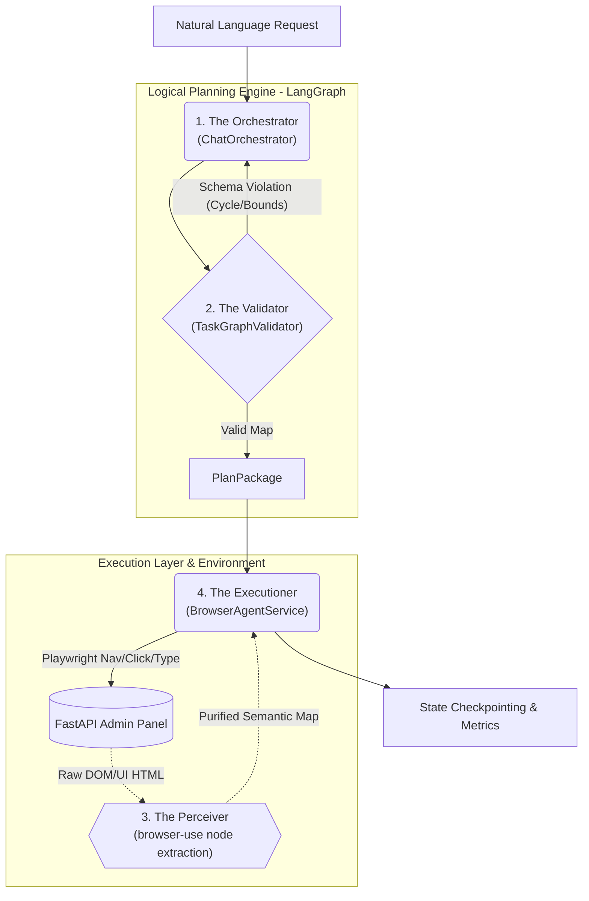

# Phoenix Wright: Autonomous IT Administration Agent

**Phoenix Wright** is a high-availability, agentic automation infrastructure engineered to securely orchestrate complex IT administration workflows. By bridging the cognitive planning capabilities of the **Gemini 2.0 Flash LLM** with headless browser traversal (`browser-use` & `Playwright`), Phoenix operates fully autonomously to execute stateful tasks against asynchronous FastAPI panels.

---

## Architecture Pipeline

The system is built on a decoupled, deterministic agentic loop utilizing LangGraph pattern principles to enforce rigid constraints over LLM non-determinism.



## Module-Wise Engineering Rationale: The Four Pillars

Our architecture formally replaces unstable conversational LLM "swarms" with strict programmatic boundaries, locking the four classic agent roles into deterministic pipelines:

### 1. The Orchestrator (`agent/orchestrator/`)
Acts as the cognitive planner. Rather than a loosely prompted persona, this is a distinct LangGraph node (`make_draft_plan_node`). It ingests human intent, isolates contextual conversation bounds, and generates a highly structured JSON DAG. It owns the primary routing logic across the cognitive loop.

### 2. The Validator (`agent/planner/`)
Replaces unreliable "AI Critics" with 100% Python determinism. It evaluates orchestrator intents into a `TaskGraph` using automated Kahn’s Sorting algorithms to intercept infinite topological cycles. It mathematically rejects invalid blueprints, throwing exact contextual faults (`CapacityExceededError` or `UnsupportedActionError`) strictly without AI hallucination.

### 3. The Perceiver (`browser-use` integration)
Handles the traditional "Observer" role natively. Rather than spinning up a separate vision LLM to stare at screenshots, it directly mounts to Chromium, strips away raw HTML/CSS noise, and extracts a purified interactive DOM bounding-box map, translating human-centric UIs into semantic data immediately.

### 4. The Executioner (`agent/services/browser_agent.py`)
Acts as the physical effector. Handed a mathematically pre-validated plan from the Validator mapping, it blindly and securely navigates the web application via Playwright without pausing to "re-think" overarching logical strategy mid-execution, drastically boosting runtime stability.

### 5. Core Robustness & Telemetry infrastructure
Built into the structural backbone for extensive operational reliability (Track B protocol framework).
- **`agent/exceptions.py`**: Granular exception taxonomy mapped perfectly to runtime faults (`BrowserTimeoutError`, `QuotaExhaustedError`, `PlanValidationError`), discarding ambiguity gracefully.
- **`agent/retry.py`**: An asynchronous network resilience wrapper dynamically mapping mathematically capped exponential backoff logic mapping against standard transit anomalies (502, 503, 504 codes).
- **`agent/state_manager.py`**: Realtime `.phoenix_checkpoints/` IO caching of node-level metadata for robust audit-trails.
- **`agent/metrics.py`**: Session retention tracking for timing variances, efficiency markers, and slash command diagnostics.

### 6. `panel/` — The Web Simulation Target
A native, locally hosted asynchronous Python `FastAPI` instance interacting with `SQLite` under `SQLAlchemy` acting as the automation testing vector enforcing dynamic DOM payloads (Forms, Selectors, JS Rendering).

---

## Setup & Deployment Instructions

### 1. Provision the Environment
```bash
python3 -m venv .venv
source .venv/bin/activate
pip install -r requirements.txt
playwright install chromium
```

### 2. Configure Local Environment State
Duplicate `.env.example` into a local `.env` and grant Gemini integration key provisioning:
```env
GEMINI_API_KEY=your_genai_token
```

### 3. Spin Up Infrastructure
Initialize the headless testing backend on terminal 1:
```bash
uvicorn panel.main:app --port 8000
```
> **Critical Edge Testing:** Force a clean `SQLite` initial bootstrap layer using `curl -X POST localhost:8000/reset` to wipe contaminated profile data between test rounds.

### 4. Engage the Agent Output Subsystem
In terminal 2, execute binary entries targeting the central `agent.runner`:

#### Conversational Shell Environment (Default execution)
```bash
python3 -m agent.runner chat
```
Available Slash Directives:
* `/help` — Contextual diagnostic mapping overview
* `/stats` — Granular session-level compute timeline and network telemetry overview
* `/plan` — Visual readout of the compiled micro-step graph dependencies
* `/retry` — Instantly retrigger the previous package loop

#### Direct Command Mode Processing
Launch targeted operational routines seamlessly decoupled from interactive chat instances:

```bash
# Complex ad-hoc relational requests
python3 -m agent.runner query "Go to the panel and list all users with no license"

# Enforced script workflows
python3 -m agent.runner password-reset --name "Alice Johnson" --new-password "new_password123"

# Granular workflow preview constraints (Bypass Automation / Dump AI prompt context logs)
python3 -m agent.runner ensure-license --name "Dave Torres" --email "dave@corp.com" --license "adobe-cc" --dry-run
```
